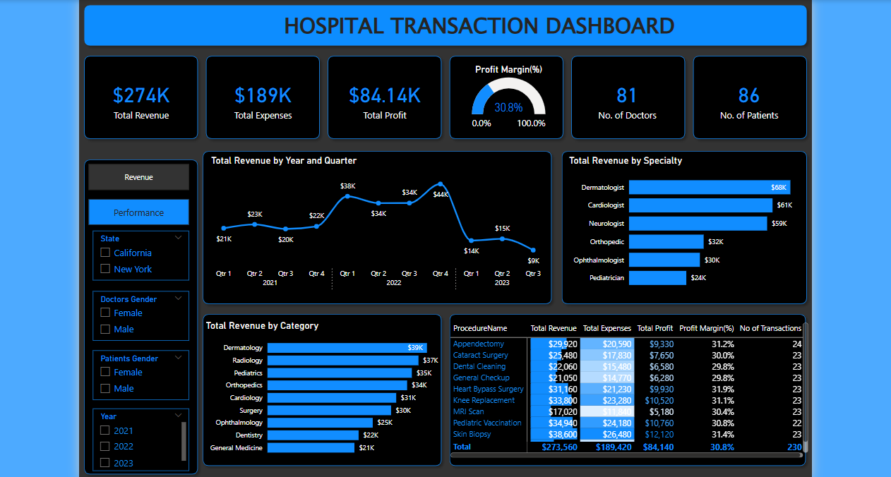
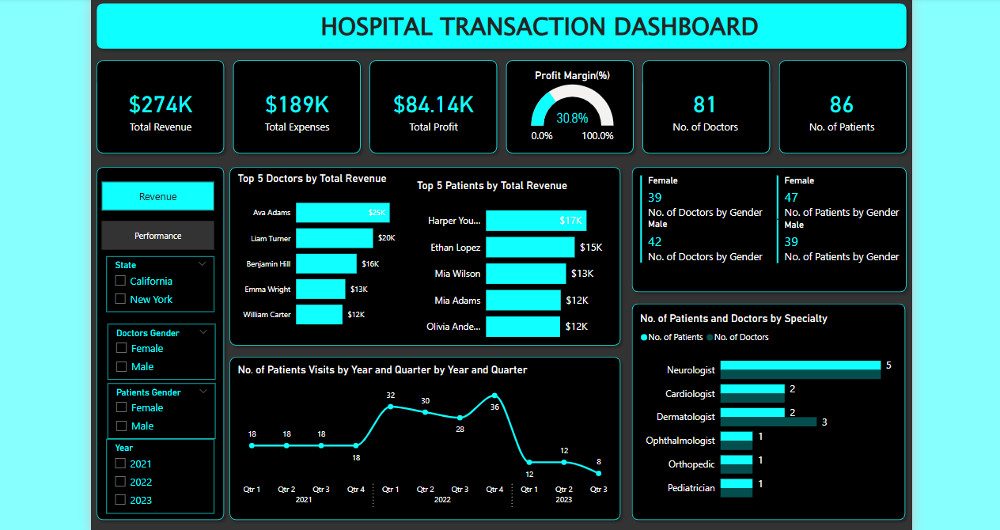

# Hospital Transaction Analysis 

## Table of Contents
1. Introduction
2. Business Problem
3. Data Source
4. Data Preparation and Transformation
5. Key Metrics
6. Dashboard Visualizations
7. Analysis and Insights
8. Conclusion and Recommendations

## Introduction
Hospitals generate vast amounts of transactional data that can be leveraged for financial and operational analysis. This report presents a Power BI dashboard designed to provide actionable insights into revenue streams, doctor performance, and patient distribution.

## Business Problem
The hospital administration needs better financial oversight and performance tracking. This study addresses the following objectives:
- Analyse revenue trends across different medical specialties.
- Identify the most profitable procedures and specialties.
- Assess doctor and patient distribution.
- Improve financial decision-making based on key metrics.

## Data Source
The dataset includes hospital transaction records covering:
- Revenue and expenses per medical procedure.
- Number of doctors and patients.
- Profit margins and financial performance.
- Patient visits and demographic details.

## Data Preparation and Transformation
The dataset was cleaned and processed to create a structured analysis. Key transformations included:
- Aggregation of revenue, expenses, and profit.
- Categorization of procedures by specialty.
- Filtering data by year, gender, and transaction details.

## Key Metrics
- **Total Revenue:** $274K
- **Total Expenses:** $189K
- **Total Profit:** $84.14K
- **Profit Margin:** 30.8%
- **Number of Doctors:** 81
- **Number of Patients:** 86

## Dashboard Visualizations
The Power BI dashboard consists of two main pages:

### **Revenue Dashboard (Page 1)**
- **Revenue by Year and Quarter**: Shows financial trends over time.
- **Revenue by Specialty**: Identifies high-revenue medical fields.
- **Revenue by Category**: Highlights income sources.
- **Procedure Analysis**: Displays revenue, expenses, and profit per procedure.
- **Screenshot:** 

### **Performance Dashboard (Page 2)**
- **Top 5 Doctors by Revenue**: Identifies high-earning doctors.
- **Top 5 Patients by Revenue**: Highlights key hospital contributors.
- **Patient Visits Trend**: Tracks fluctuations in patient footfall.
- **Doctors and Patients by Specialty**: Analyses the balance between availability and demand.
- **Screenshot:** 

## Analysis and Insights
### **Revenue and Profitability Trends**
- Q4 2022 recorded the highest revenue at $44K, with a decline in early 2023.
- **Dermatology** generated the highest revenue ($68K), followed by **Cardiology** and **Orthopaedics**.
- **Appendectomy** and **Cataract Surgery** were the top revenue-generating procedures.

### **Doctor and Patient Distribution**
- The hospital has 42 male doctors and 39 female doctors.
- Patient distribution is almost even, with a slight male majority.
- Neurology has the highest patient count (5), suggesting high demand.

### **Performance Trends**
- **Top-performing doctor:** Ava Adams ($25K revenue generated).
- **Top-paying patient:** Harper Young ($17K spent on treatments).
- **Patient visits peaked in Q4 2022**, with a decline in early 2023.

## Conclusion and Recommendations
The Power BI dashboard provides comprehensive insights into financial performance, doctor efficiency, and patient trends. Hospitals can leverage these insights to:
- Improve patient retention strategies to maintain revenue growth.
- Expand high-revenue specialties such as Dermatology and Cardiology.
- Optimize scheduling to balance patient visits across departments.
- Monitor expense patterns to increase overall profitability.

By continuously monitoring key metrics, hospitals can enhance financial sustainability and operational efficiency, leading to improved patient care and revenue growth.
